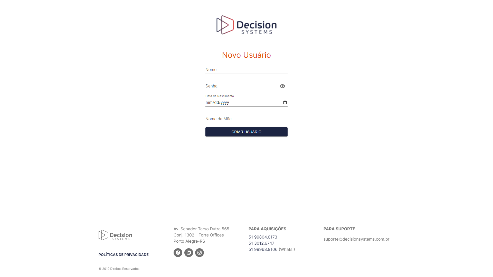
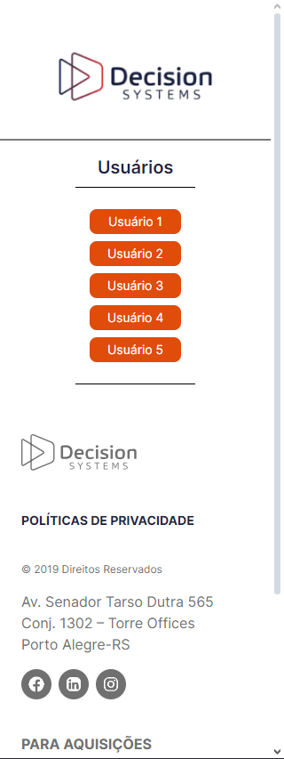

# Desafio Front/Full-Stack
## (Última atualização) - 15/06/2024
### Este projeto é a solução de um desafio sobre React, construindo um pequeno CRUD e integrando algumas ações de Formulário.

## Índice

- [Geral](#geral)
  - [Desafio](#desafio)
  - [Links](#links)
- [Meu Processo](#meu-processo)
  - [Tecnologias](#-tecnologias)
  - [Sobre](#sobre)
  - [Solução](#-solução)
  - [Melhorias](#muscle-melhorias)
- [Autor](#autor)

## Geral

### Desafio
Desenvolver um sistema de cadastro de usuários com frontend obrigatório e backend opcional.

**Frontend:**

- Criar formulário responsivo em ReactJS com final-form, yup e Material-UI.
- Implementar validações para campos obrigatórios e data de nascimento.
- Esconder senha durante digitação.
- Rotas para criar e editar usuários.

**Backend (opcional):**

- Node.js com TypeScript, REST ou GraphQL.
- Persistência local ou em banco de dados.
- Segurança para dados sensíveis (senha, nome da mãe).

### Links

- Site da empresa: [Decision Systems](https://decisionsystems.com.br)
- Solução: [GitHub Repo](https://github.com/bigodrigo/decision-challenge)
- Deploy: [Vercel](https://decision-challenge.vercel.app)


## Meu Processo

### 🚀 Tecnologias

- [Typescript](https://www.typescriptlang.org)
- [React](https://react.dev)
- [Next.js](https://nextjs.org/docs)
- [Tailwind](https://tailwindcss.com)
- [Prisma](https://www.prisma.io)
- [Material UI](https://mui.com)
- [Yup](https://www.npmjs.com/package/yup)
- [Final Form](https://final-form.org)

### Sobre

- O projeto possui 4 rotas básicas, uma Home Page, uma rota para Criar, outra para Editar e uma Lista de todos os usuários. Fiz a escolha de manter a identidade visual da empresa, reproduzindo, dentro do possível, as mesmas cores, layouts como footer e animações de hover. Os layouts são responsivos para os tamanhos de um celular (320px), um tablet (768px) e uma página web (1024px).

- Para garantir a persistencia dos dados, utilizei o Prisma que permite a flexibilidade de lidar com diversos Bancos de dados, neste projeto exite um arquivo SQLite contendo uma estrutura básica e alguns dados. Além disto um arquivo seed permite a rápida configuração de alguns usuários para testagem. 

- Como senha e nome da mãe são informações sensíveis, optei por adicionar o mecanismo de criptografia (hash) somente para a senha que é guardada no banco de dados e não permitir a sua edição.

### Guia Rápido

- Após a clonagem do projeto é necessário instalar todas as dependências:

```bash
npm i
```
- Pode ser necessário criar o arquivo local '.env' e adicionar o caminho para o Arquivo do Banco de dados: DATABASE_URL="file:./dev.db"

- Depois disto, basta executar o servidor e navegar entre as páginas:
```bash
npm run dev
# or
yarn dev
```

- Abra [http://localhost:3000](http://localhost:3000) e navegue, por exemplo pela página de [Criação](http://localhost:3000/usuarios/criar) ou [Lista](http://localhost:3000/usuarios).

- A adição do Prisma permite reconfigurar a tabela de dados, utilizando os comandos:
```bash
npx prisma migrate reset --force

npx prisma db push

npx prisma db seed
```

### Comentários

- A Pasta [Biblioteca](/src/lib/) possui alguns scripts interessantes onde definimos a Tipagem para o Typescript, montamos o Esquema para validação com o Yup e realizamos a criptografia da senha.

- A Pasta [Servidor](/src/server/) possui funções que utilizam as [Server Actions](https://nextjs.org/docs/app/building-your-application/data-fetching/server-actions-and-mutations), estas são atualizações recentes que otimizam a forma clássica de utilizar um fetch, POST, etc.
```js
  const onSubmit = async (values: UserFormValues) => {
    // Rota clássica de api/POST
    const response = await fetch('/api/usuarios', {
      method: 'POST',
      headers: {
        'Content-Type': 'application/json',
      },
      body: JSON.stringify(formData),
    });
  }

  // Server action
  "use server"
  return (<form action={createUser}>)
```

- A função createUser possui um trecho de código comentado que pode ser usado para testar um possível erro na comunicação com a API;
```js
// Simulando um erro para fins de teste
return new Promise((_, reject) => {
    setTimeout(() => reject(new Error('Erro simulado ao criar usuário')), 500);
});
```

- Caso um usuário seja deletado ou o id não exista, a página é redirecionada para a Lista de usuários.
```js
  const user = await prisma.user.findUnique({
    where: {
      id: Number(params.id),
    },
  });

  if (!user) {
    return redirect('/usuarios'); // Redirecionar se o usuário não for encontrado
  }
```

- O Footer é bastante similar ao Original da Empresa, as redes sociais da empresa estão acessíveis nos seus respectivos botões.

### 🔖 Solução

<div align="center">
    <p>Página de Criação de Usuário:</p>
    
</div>

<div align="center">
    <p>Lista de Usuários e Edição (Mobile):</p>
    
    
</div>


### :muscle: Melhorias:

- [x] Vercel;
- [x] Docker;
- [ ] Adicionar um Modal ou Popup que peça a confirmação na hora de deletar um usuário;
- [ ] Criar um Script que verifica se a data de nascimento corresponde a um adulto (>18anos);
- [ ] Separar as funções de Edição e Deletar -> Principios de SOLID;

## Autor

- Portfolio - [Rodrigo](https://portfolio-bigodrigo.vercel.app/)
- GitHub - [bigodrigo](https://github.com/bigodrigo)
- Linkedin - [rodrigo-boquer](https://www.linkedin.com/in/rodrigo-boquer/)

